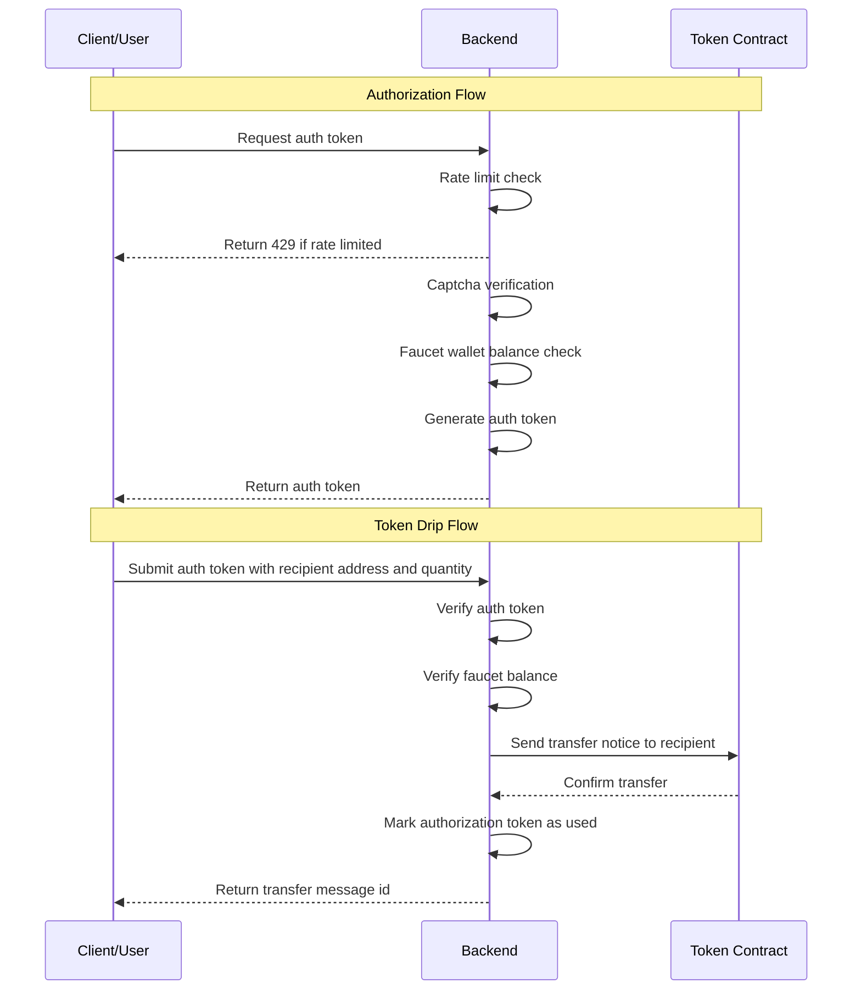

# AR.IO Testnet Token Minting Service

## Overview

This service allows users to drip tokens to a recipient's wallet address on the AR.IO Testnet using an asynchronous authorization token system. It features APIs for requesting and verifying authorization tokens, and an additional API for dripping tokens to a recipient's wallet address. Additional protections, including rate limiting and captcha support, are enabled by default , but can be disabled/modified through respective [environment variables](#environment-variables).




## Requesting an Authorization Token

Users can request an authorization token for a recipient by sending a POST request to the `/api/request` endpoint with the recipient's address in the request body. The request body must also include a `processId` which is used to identify the process that is requesting the token. Once the authorization token is requested, it can be used to drip tokens to the recipient's wallet address via the `/api/drip` endpoint. By default, the authorization token will allocate 10,000 tokens to the recipient.

```bash
curl -X POST http://localhost:3000/api/request -H "Content-Type: application/json" -d '{"processId": "<processId>"}'
```


## Verifying an Authorization Token

Users can verify an authorization token by sending a GET request to the `/api/verify` endpoint with the token in the query parameters. The token is verified by checking the signature of the token payload and the payload's nonce to ensure the token is valid and has not been used.

```bash
curl -X GET http://localhost:3000/api/verify?token=<token>&processId=<processId>
```


## Dripping Tokens

Users can then drip tokens to a recipient by sending a POST request to the `/api/drip` endpoint with the authorization token returned from the `/api/request` endpoint. The authorization token is verified by checking the signature of the token payload and the payload's nonce to ensure the token is valid and has not been used. Once the token is verified, the tokens are transferred to the recipient's wallet address and the authorization token is marked as used.

```bash
curl -X POST http://localhost:3000/api/drip -H "Content-Type: application/json" -H "Authorization: Bearer <auth-token>" -d '{"processId": "<processId>", "recipient": "<recipient_address>", "qty": <qty> }'
```


## Rate Limiting

The service includes a rate limiting mechanism to prevent abuse. By default, the `/api/request` endpoint is limited to 1 requests per hour. This can be adjusted by changing the `RATE_LIMIT_*` environment variables.

## Captcha Protection

The service includes a [hCaptcha](https://hcaptcha.com/) protection mechanism to prevent abuse. By default, the service will require a captcha to be solved before a token can be dripped. This can be disabled by setting the `DISABLE_CAPTCHA_VERIFICATION` environment variable to `true`.

## Environment Variables

The service supports the following environment variables:

- `RATE_LIMIT_WINDOW_MS`: The rate limit window in milliseconds (e.g. 1 hour).
- `RATE_LIMIT_THRESHOLD`: The rate limit threshold (e.g. 100 requests per window).
- `CAPTCHA_ENABLED`: Whether captcha protection is enabled. By default, the service will require a captcha.
- `CAPTCHA_SECRET`: The secret key for the captcha. This is used to verify the captcha on the back-end.
- `CAPTCHA_SITE_KEY`: The site key for the captcha. This is used to render the captcha on the front-end.
- `CAPTCHA_SITE_VERIFY_URL`: The URL for the captcha site verify endpoint (defaults to `https://hcaptcha.com/siteverify`).
- `DISABLE_CAPTCHA_VERIFICATION`: Whether captcha verification is disabled. By default, the service will require a captcha.
- `DISABLE_SELF_HOSTED_FRONTEND`: Whether the self-hosted front-end is disabled. By default, the service will serve a simple front-end for testing.
- `WALLET_FILE`: The path to the wallet file. This is the wallet that will be used to drip the tokens to the recipient's wallet address and is used to sign authorization tokens.
- `PORT`: The port for the service to run on
- `LOG_LEVEL`: The log level for the service.
- `LOG_FORMAT`: The log format for the service.
