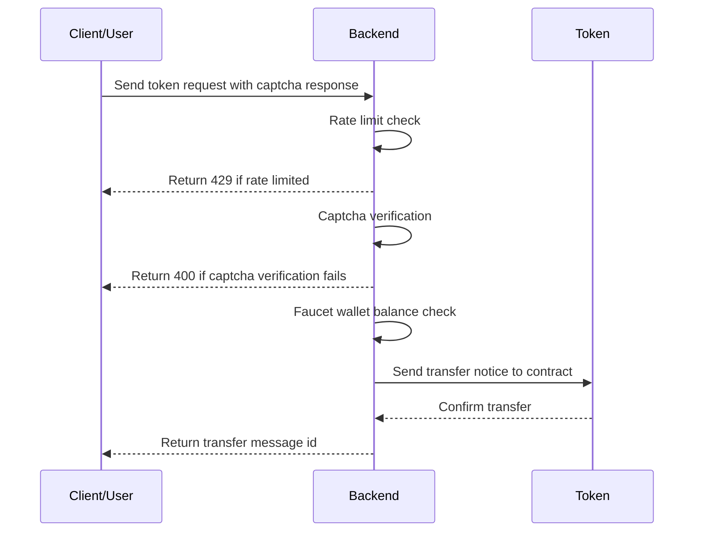
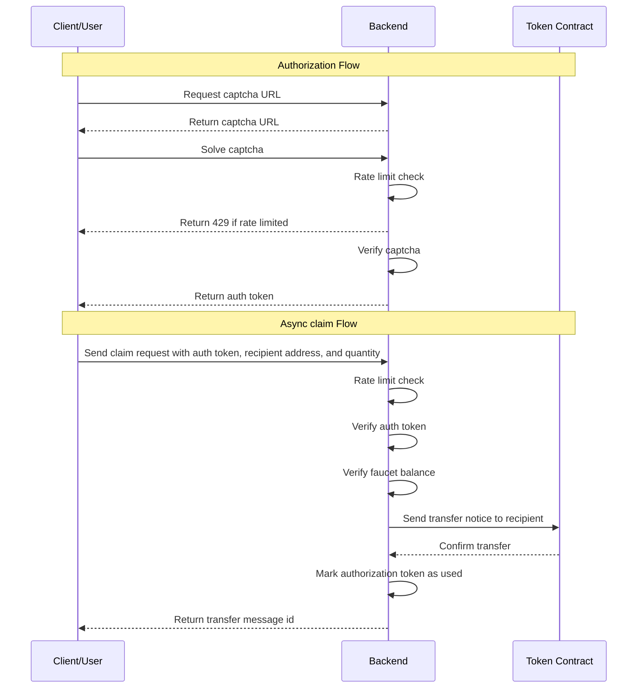

# 🚰 AR.IO Faucet Service

This service supports a request-based workflow for acquiring tokens on the AR.IO Testnet Network (tARIO).

## Table of Contents

- [AR.IO Faucet Service](#ario-faucet-service)
  - [Table of Contents](#table-of-contents)
  - [Claiming Tokens](#claiming-tokens)
    - [Synchronous Workflow](#synchronous-workflow)
    - [Asynchronous Workflow](#asynchronous-workflow)
      - [Requesting a Captcha URL](#requesting-a-captcha-url)
      - [Generating an Authorization Token](#generating-an-authorization-token)
      - [Verifying an Authorization Token](#verifying-an-authorization-token)
    - [Claiming Tokens with an Authorization Token](#claiming-tokens-with-an-authorization-token)
  - [Rate Limiting](#rate-limiting)
  - [Captcha Protection](#captcha-protection)
  - [Environment Variables](#environment-variables)

## Claiming Tokens

### Synchronous Workflow



To claim tokens synchronously with a captcha response, send a POST request to the `/api/claim/sync` endpoint with the following JSON body:

```bash
curl -X POST http://localhost:3000/api/claim/sync -H "Content-Type: application/json" -d '{"captchaResponse": "<captcha-response>", "recipient": "<recipient-address>", "qty": "<quantity>"}'
```

The response will be a JSON object with the following properties:

- `id`: The transaction id of the token transfer, if successful.
- `status`: The status of the claim request.
- `error`: The error message if the claim request failed.

### Asynchronous Workflow



#### Requesting a Captcha URL

Users can request a captcha URL by sending a GET request to the `/api/captcha/url` endpoint with the `process-id` in the query parameters.

```bash
curl -X GET http://localhost:3000/api/captcha/url?process-id=<processId>
```

The response will be a JSON object with the following properties:

- `processId`: The processId of the process that is requesting the token.
- `captchaUrl`: The URL for the captcha. This URL will redirect to the front-end where the user can solve the captcha and then return to the back-end with the token.

#### Generating an Authorization Token

Users can generate an authorization token by sending a POST request to the `/api/captcha/verify` endpoint with the `processId` and `captchaResponse` in the body.

```bash
curl -X POST http://localhost:3000/api/captcha/verify -H "Content-Type: application/json" -d '{"processId": "<processId>", "captchaResponse": "<captcha-response>"}'
```

The response will be a JSON object with the following properties:

- `status`: The status of the captcha verification.
- `token`: The auth token that can be used to claim tokens.
- `expiresAt`: The timestamp when the token will expire.

#### Verifying an Authorization Token

Users can verify an existing authorization token by sending a GET request to the `/api/token/verify` endpoint with the token in the query parameters.

```bash
curl -X GET http://localhost:3000/api/token/verify?process-id=<processId> \
 -H "Authorization: Bearer <auth-token>"
```

The response will be a JSON object with the following properties:

- `valid`: Whether the token is valid and can be used to claim tokens.
- `expiresAt`: The timestamp when the token will expire.

### Claiming Tokens with an Authorization Token

Users can then claim tokens to a recipient by sending a POST request to the `/api/claim/async` endpoint with the authorization token returned after the captcha is solved. The authorization token is verified, the faucet balance is checked, and the tokens are transferred to the recipient's wallet address.

```bash
curl -X POST http://localhost:3000/api/claim/async \
 -H "Content-Type: application/json" \
 -H "Authorization: Bearer <auth-token>" \
 -d '{"processId": "<process_id>", "recipient": "<recipient_address>", "qty": <qty> }'
```

## Rate Limiting

The service includes various rate limiting mechanisms to prevent abuse, defaulting to a global rate limit of 10 requests per hour and a captcha rate limit of 1 request per hour. This can be adjusted by changing the `*_RATE_LIMIT_*` environment variables.

## Captcha Protection

The service includes a [hCaptcha](https://hcaptcha.com/) protection mechanism to prevent abuse. By default, the service will require a captcha to be solved before a token can be claimed. This can be disabled by setting the `DISABLE_CAPTCHA_VERIFICATION` environment variable to `true`.

## Security Model & Single-Instance Limitation

Anti-replay and anti-sybil state (consumed token nonces and the per-GitHub-id
claim window) are held in-process, in memory. The concurrent-replay drain — where
N simultaneous requests carrying the same JWT could all pass the check and all
transfer — is closed by an **atomic reserve-before-transfer**: the nonce (and,
at the OAuth callback, the per-GitHub-id slot) is reserved with a synchronous
set-if-absent (`has()`+`set()` in one critical section, no `await` in between)
**before** the on-chain transfer is dispatched. Of N concurrent claims sharing a
token, exactly one wins the reservation; the rest are rejected before any tokens
move. Reservations roll back only on a definitive transfer failure.

**Accepted limitation (single-box devnet target):** because this state is
per-process, it resets on restart and is NOT shared across replicas. Running
multiple instances behind a load balancer would let the same JWT/GitHub id claim
once per replica, and a restart clears the window early. This is acceptable for
the intended single-instance devnet faucet. A durable, shared store
(SQLite/Redis) is intentionally deferred; see the `TODO` markers in
`src/cache/token-cache.ts`. Do not run more than one replica without adding one.

The browser claim flow delivers the claim JWT via an **HttpOnly + Secure +
SameSite=Lax cookie** scoped to `/api` (not a URL fragment), bound to the session
that initiated the OAuth flow (a session id is carried in the OAuth `state` and
embedded in the JWT, then matched against the `faucet_sid` cookie at claim time).

When running behind a reverse proxy, set `TRUST_PROXY=true` so `X-Forwarded-For`
is honored (via `ctx.ip`) for rate limiting and hCaptcha. When it is unset the
header is ignored and the socket address is used, so clients cannot spoof their
source IP to bypass rate limits.

## Environment Variables

The service supports the following environment variables:

- `TRUST_PROXY`: Set to `true` only when running behind a known reverse proxy so `X-Forwarded-For` is trusted; otherwise the header is ignored (default: `false`).
- `COOKIE_SECURE`: Whether the session/claim cookies carry the `Secure` flag. Defaults to `true`; set to `false` only for local plain-HTTP development.

- `GLOBAL_RATE_LIMIT_WINDOW_SECONDS`: The global rate limit window in seconds (e.g. 1 hour)
- `GLOBAL_RATE_LIMIT_THRESHOLD`: The global rate limit threshold (e.g. 100 requests per window)
- `CAPTCHA_RATE_LIMIT_WINDOW_SECONDS`: The captcha rate limit window in seconds (e.g. 1 hour)
- `CAPTCHA_RATE_LIMIT_THRESHOLD`: The captcha rate limit threshold (e.g. 100 requests per window)
- `CAPTCHA_ENABLED`: Whether captcha protection is enabled. By default, the service will require a captcha.
- `CAPTCHA_SECRET`: The secret key for the captcha. This is used to verify the captcha on the back-end.
- `CAPTCHA_SITE_KEY`: The site key for the captcha. This is used to render the captcha on the front-end.
- `CAPTCHA_SITE_VERIFY_URL`: The URL for the captcha site verify endpoint (defaults to `https://hcaptcha.com/siteverify`).
- `REQUIRE_CAPTCHA_VERIFICATION`: Whether captcha verification is required, defaults to `true`.
- `ENABLE_SELF_HOSTED_FRONTEND`: Whether the self-hosted front-end is enabled, defaults to `true`.
- `WALLET_FILE`: The path to the wallet file. This wallet is must have sufficient balance of requested tokens.
- `DEFAULT_FAUCET_TOKEN_TRANSFER_QTY`: The default quantity of tokens to transfer when claiming tokens.
- `DEFAULT_MIN_FAUCET_TOKEN_TRANSFER_QTY`: The minimum quantity of tokens to transfer when claiming tokens.
- `DEFAULT_MAX_FAUCET_TOKEN_TRANSFER_QTY`: The maximum quantity of tokens to transfer when claiming tokens.
- `PORT`: The port for the service to run on
- `LOG_LEVEL`: The log level for the service.
- `LOG_FORMAT`: The log format for the service.
