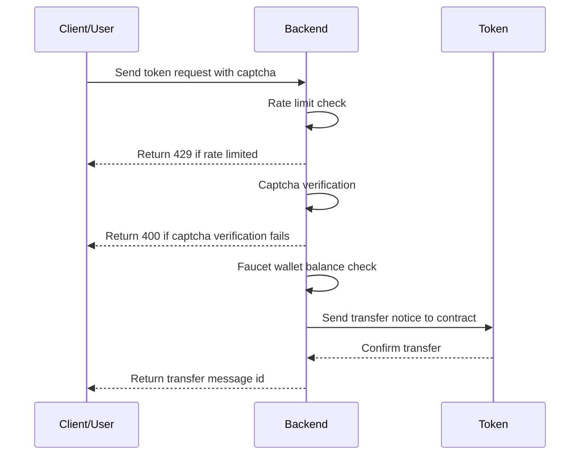
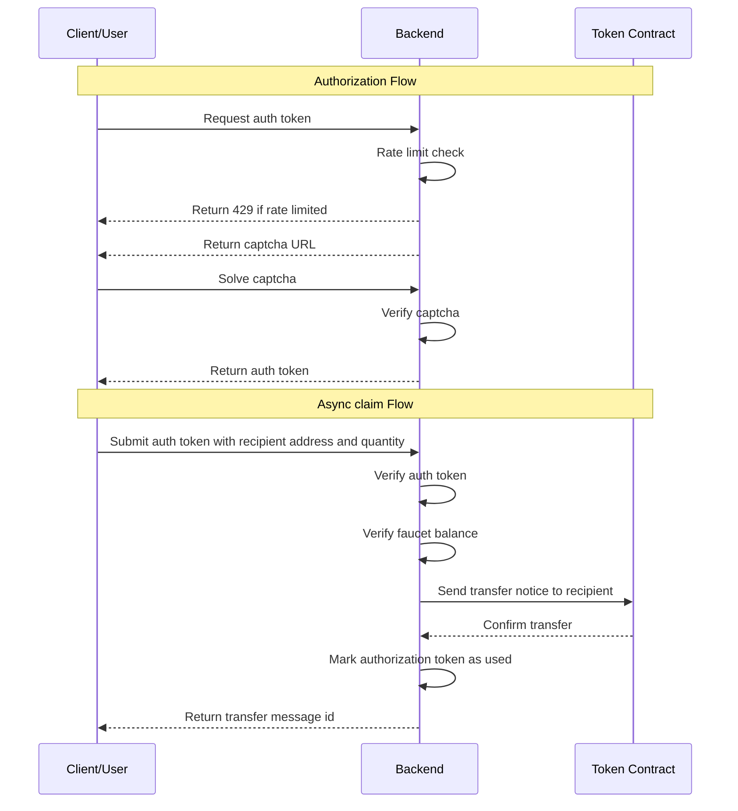

# AR.IO Testnet Token Minting Service

This service supports a request-based workflow for acquiring tokens on the AR.IO Testnet Network.

## Table of Contents

- [Claiming Tokens](#claiming-tokens)
  - [Synchronous Workflow](#synchronous-workflow)
  - [Asynchronous Workflow](#asynchronous-workflow)
    - [Requesting an Authorization Token](#requesting-an-authorization-token)
    - [Verifying an Authorization Token](#verifying-an-authorization-token)
    - [Claiming Tokens with an Authorization Token](#claiming-tokens-with-an-authorization-token)
- [Rate Limiting](#rate-limiting)
- [Captcha Protection](#captcha-protection)

## Claiming Tokens

### Synchronous Workflow



To claim tokens synchronously with a captcha response, send a POST request to the `/api/claim/sync` endpoint with the following JSON body:

```bash
curl -X POST http://localhost:3000/api/claim/sync -H "Content-Type: application/json" -d '{"captchaResponse": "<captcha-response>", "recipient": "<recipient-address>", "qty": "<quantity>"}'
```

The response will be a JSON object with the following properties:

- `id`: The transaction id of the token transfer, if successful.
- `status`: The status of the claim request.
- `error`: The error message if the claim request failed.

### Asynchronous Workflow



#### Requesting an Authorization Token

Users can request a captcha URL by sending a GET request to the `/api/token/request` endpoint with the `process-id` in the query parameters.

```bash
curl -X GET http://localhost:3000/api/token/request?process-id=<processId>
```

The response will be a JSON object with the following properties:

- `processId`: The processId of the process that is requesting the token.
- `captchaUrl`: The URL for the captcha. This URL will redirect to the front-end where the user can solve the captcha and then return to the back-end with the token.


#### Verifying an Authorization Token

Users can verify an existing authorization token by sending a GET request to the `/api/token/verify` endpoint with the token in the query parameters.

```bash
curl -X GET http://localhost:3000/api/token/verify?process-id=<processId> -H "Authorization: Bearer <auth-token>"
```

The response will be a JSON object with the following properties:

- `valid`: Whether the token is valid and can be used to claim tokens.
- `expiresAt`: The timestamp when the token will expire.

### Claiming Tokens with an Authorization Token

Users can then claim tokens to a recipient by sending a POST request to the `/api/claim/async` endpoint with the authorization token returned after the captcha is solved. The authorization token is verified, the faucet balance is checked, and the tokens are transferred to the recipient's wallet address.

```bash
curl -X POST http://localhost:3000/api/claim/async -H "Content-Type: application/json" -H "Authorization: Bearer <auth-token>" -d '{"processId": "<process_id>", "recipient": "<recipient_address>", "qty": <qty> }'
```

## Rate Limiting

The service includes a rate limiting mechanism to prevent abuse, defaulting to 100 requests per hour. This can be adjusted by changing the `RATE_LIMIT_*` environment variables.

## Captcha Protection

The service includes a [hCaptcha](https://hcaptcha.com/) protection mechanism to prevent abuse. By default, the service will require a captcha to be solved before a token can be claimped. This can be disabled by setting the `DISABLE_CAPTCHA_VERIFICATION` environment variable to `true`.


## Environment Variables

The service supports the following environment variables:

- `RATE_LIMIT_WINDOW_MS`: The rate limit window in milliseconds (e.g. 1 hour)
- `RATE_LIMIT_THRESHOLD`: The rate limit threshold (e.g. 100 requests per window)
- `CAPTCHA_ENABLED`: Whether captcha protection is enabled. By default, the service will require a captcha.
- `CAPTCHA_SECRET`: The secret key for the captcha. This is used to verify the captcha on the back-end.
- `CAPTCHA_SITE_KEY`: The site key for the captcha. This is used to render the captcha on the front-end.
- `CAPTCHA_SITE_VERIFY_URL`: The URL for the captcha site verify endpoint (defaults to `https://hcaptcha.com/siteverify`).
- `REQUIRE_CAPTCHA_VERIFICATION`: Whether captcha verification is required, defaults to `true`.
- `ENABLE_SELF_HOSTED_FRONTEND`: Whether the self-hosted front-end is enabled, defaults to `true`.
- `WALLET_FILE`: The path to the wallet file. This wallet is must have sufficient balance of requested tokens.
- `PORT`: The port for the service to run on
- `LOG_LEVEL`: The log level for the service.
- `LOG_FORMAT`: The log format for the service.
